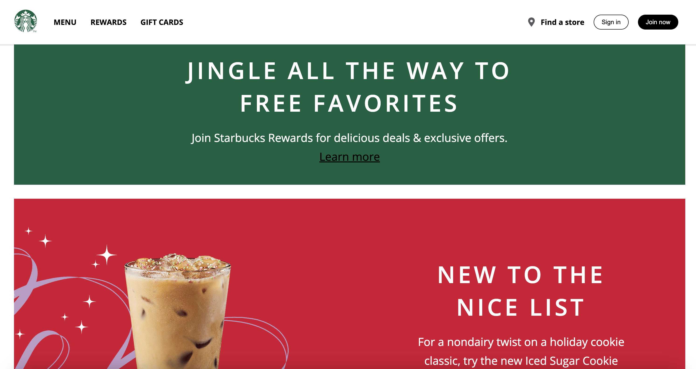

# ☕ Starbucks Coffee Company Clone

This project is a Starbucks-inspired landing page built with HTML, CSS, and JavaScript.

It recreates the modern Starbucks website experience with a responsive navigation bar, interactive mobile menu, and promotional sections highlighting seasonal drinks and offers.

## Live Site

<https://starbucks-homepage-eight.vercel.app/>

## 🚀 Features

- Responsive Navbar with desktop and mobile menus
- Hamburger menu for small screens
- Promotional content sections (holiday offers, seasonal drinks, and campaigns)
- Reusable button styles (dark, light-outline, etc.)
- Footer with social links (Spotify, Facebook, Pinterest, Instagram, YouTube, Twitter)
- Responsive design for different screen sizes

## 🛠️ Technologies Used

- HTML – Semantic structure
- CSS – Styling and layout (Flexbox & Grid)
- JavaScript (Vanilla) – Mobile menu toggle functionality

## ⚡ Getting Started

1. Clone the repository:

```bash
git clone https://github.com/philipstubbs13/starbucks-homepage
```

2. Navigate into the project folder:

```bash
cd starbucks-homepage
```

3. Open the `index.html` in your browser.

## 📸 Preview



## 🎯 Future Improvements

- Add more interactivity (e.g., login/sign-up modals)
- Integrate with a backend to handle rewards or orders
- Add animations for smoother transitions

## 📜 License

This project is for educational purposes only.

All Starbucks trademarks, logos, and branding belong to Starbucks Coffee Company.
